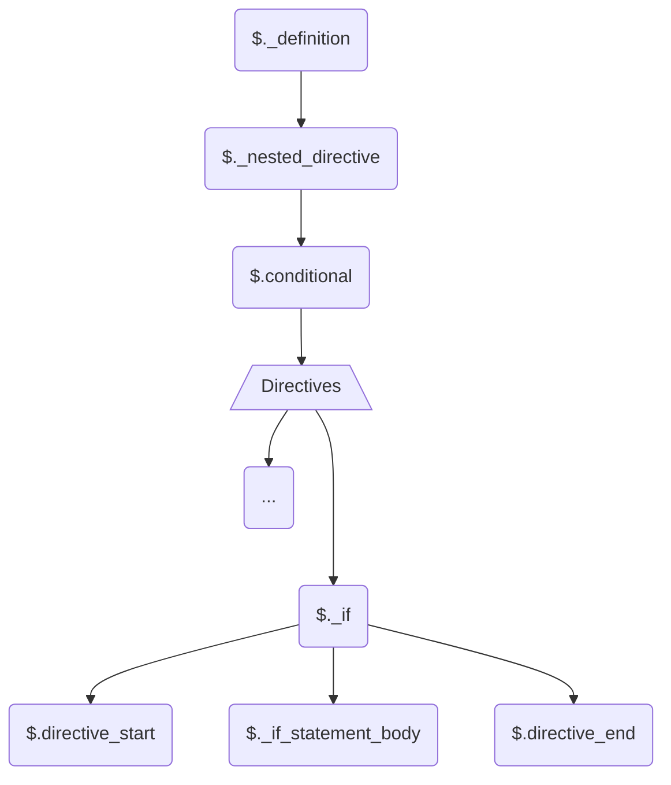

# HELLO! 👋

Welcome to the contribution guide, and I hope you are enjoying the
grammar. Here you will find out how the grammar is organised and how
you can contribute, so that it adheres to the grammar styles.

### Prerequisite:

-   You need to know how to use the
    [tree-sitter cli](https://tree-sitter.github.io/tree-sitter/creating-parsers#tool-overview)
    for generating and testing
-   Make sure you are familiar with this chapter from
    [tree-sitter](https://tree-sitter.github.io/tree-sitter/creating-parsers#writing-the-grammar)
    especially the functions.
-   In-depth knowledge is not necessary unless you are contributing to
    the core.

### General Overview:

The grammar is pretty abstracted, i.e., there are many aliases and
hidden rules. However I personally believe it is easy to read and
follow. This was intentional so that it is future proof, extensible
and maintainable. Thanks to this, there is a 98% chance that the
future new directive rules can be added with **no more than 6 lines of
code**!

### How to set up

1. Clone this repo
2. Install the dependancies: `npm i`
3. To check if your setup is working, simply run:
    - `npm run test`: This will run the Unit Test to ensure you have
      not broken functionalities
    - `npm run example-test`: This will try to parse alot of common
      Laravel Method for an automated test drive :)
        > Make sure you have set up your `tree-sitter`'s
        > `parser-directories` path correctly in your config file see
        > [path](https://tree-sitter.github.io/tree-sitter/syntax-highlighting#paths)

### Overview

Go ahead open up the `grammar.js` in the root directory.

Everything is organized in the order they appear in the document
inside `$._definition`. The `rules` are then made up like lego using
the "building block" rules that were written at the bottom of the
`grammar.js`. As a result, any changes below the 'warning comment' ⚠️
**are likely to cause breakage** ⚠️, so make sure you run the unit
tests every time you amend anything. However it is very unlikely you
would need to touch anything below that line, unless you are writing a
very **complicated** rule.

### $.\_definition:

This is basically what the parser uses as a starting point to read the
`blade` document. The following explains the grouping/name convention:

#### 1. $.keyword:

These are the stand-alone directives that can appear anywhere in the
document, with **_NO_** _parameters_ for example:

-   `@csrf`

#### 2. $.php_statement

These are the directives or rules that need their content parsed as
`php_only`

-   `{{}}`
-   `{!! !!}`
-   ...

#### 3. $.attribute

Blade attributes, such as:

-   `@class()`
-   `@style()`
-   ...

#### 4. $.\_inline_directive

These are the directives that **_take on_** parameters.

-   `@yield()`
-   `@extends()`
-   ...
    > Names starting with `_` are hiddent when parsing. see
    > [tree-sitter](https://tree-sitter.github.io/tree-sitter/creating-parsers#writing-the-grammar)

#### 5. $.\_nested_directives

Directive that have _start_ and _end_ directive, with a _body_

-   `@if() @endif`
-   `@error @enderror`
-   ...

#### 6. $.loop_operator

Very unlikely you would need to touch this, but these are loop
operators that can appear in any subtree.

-   `@break`
-   `@continue`
-   ...

#### 7. $.php_only

Integral node, which is used for `php_only` injections. This is based
on the `$._text` node

#### 8. $.text

This is a general use text node. In this grammar it can be used,
alongside predicates in the `injection.scm` to achieve interesting
outcome. Such as injecting normal `text`, `html` or even `shell`. This
is also built on `$._text`

#### 9. $.\_text

This should not be used, instead you should opt for `$.text` or
`$.php_only` if needed

### Adding New Directives:

The first thing to do is to determine what category it belongs to.
Look at the `$._definition`, pick a rule group, and dig in, to get an
idea.

As an example look below on how the `@if` directive is defined:



### Test it:

Whenever you define a new rule, you need to test it in two ways:

1. You could use the automated parsing to test drive the parser
    - You would need to run the following command.
    - This will download a few of the Laravel-based repositories and
      parse the blade files.

```bash
npm run test-example
```

2. To ensure your rule is not breaking any other rules, just do the
   following to run the unit test:

```
npm run test
```

If all green you are good to go 👍

Once happy with your result, write the appropriate unit `test` in
`test/corpus/`. You could either use any of the categories or make
your own.

### Pull requests:

-   Just follow the pull request template and ensure you have
    completed all necessary steps. 😊"
