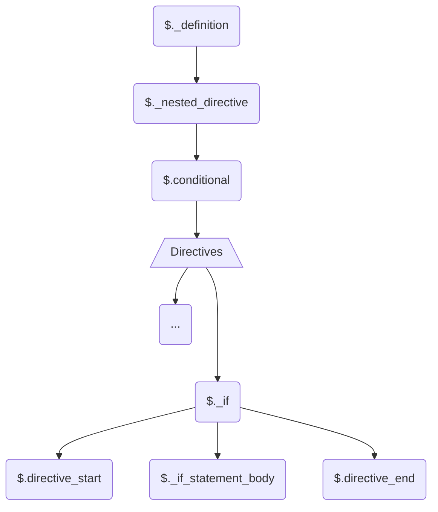

# HELLO! 👋

Welcome to the contribution guide, and I hope you enjoyed the grammar.
Here you will find out how the grammar is organised and how you can
contribute, so that it adheres to the grammar styles.

### Prerequisite:

-   You need to know how to use the
    [tree-sitter cli](https://tree-sitter.github.io/tree-sitter/creating-parsers#tool-overview)
    for generating and testing
-   Make sure you are familiar with this chapter from
    [tree-sitter](https://tree-sitter.github.io/tree-sitter/creating-parsers#writing-the-grammar)
    especially the functions.
-   in depth knowledge is not necessary unless you are contributing to
    the core.

### General Overview:

The grammar is pretty abstracted, i.e there are lots of aliases and
hidden rules. However I personally believe it is easy to read and
follow. This was intentional so that it is future proof, extensible
and maintainable. Thanks to this, there is a 98% chance that the
future new directive rules can be added with **no more than 6 lines of
code**!

### How to set up

1. Clone this repo
2. Install the dependancies
3. To check if your set up is working just run `npm run test`.
    > Make sure you have set up your `tree-sitter`'s
    > `parser-directories` path correctly in your config file see
    > [path](https://tree-sitter.github.io/tree-sitter/syntax-highlighting#paths)

### Overview

Go ahead open up the `grammar.js` in the root directory.

Everything is organised in the order they appear in the document
inside`_definition`. The `rules` are then made up like lego using the
"building block" rules written at the bottom of the `grammar.js`. As a
result any changes below the "warning comment" will likely to cause
breakage, so make sure you run the test every time you amend anything.
However it is very unlikely you would need to touch anything below
that line, unless you are writing a very **complicated** rule.

### $.\_definition:

This is basically what the parser uses as a starting point to read the
`blade` document. The following explains the grouping/name convention:

#### 1. $.keyword:

These are the stand-alone directives that can appear anywhere in the
document, with **_NO_** _parameters_ for example:

-   `@csrf`

#### 2. $.php_statement

These are the directives or rules that need their content parsed as
`php`

-   `{{}}`
-   `{!! !!}`
-   ...

#### 3. $.attribute

Blade attributes, such as:

-   `@class()`
-   `@style()`
-   ...

#### 4. $.\_inline_directive

These are the directives that **_take on_** parameters.

-   `@yield()`
-   `@extends()`
-   ...
    > Names starting with `_` are hiddent when parsing. see
    > [tree-sitter](https://tree-sitter.github.io/tree-sitter/creating-parsers#writing-the-grammar)

#### 5. $.\_nested_directives

Directive that have _start_ and _end_ directive, with a _body_

-   `@if() @endif`
-   `@error @enderror`
-   ...

#### 6. $.loop_operator

Very unlikely you would need to touch this, but these are loop
operators that can appear in any subtree.

-   `@break`
-   `@continue`
-   ...

#### 7. $.text

This is another rule which is very unlikely you would need to ever
touch. This will capture anything that is not blade, and used for
`injection` purposes.

### Adding New Directives:

First thing to do is to find out what category it falls into; so look
into the `_definition`, pick rule group and dig in to get an idea.

As an example look below on how the `@if` directive is defined:



### Test it:

Whenever you define a new rule, you need to test it in two ways:

1. Write an example extract in the `example-file.blade.php`
    - Then parse it in your terminal, and check the output
    ```bash
    npm run parse
    ```
2. Once happy with your result, write the appropiate `test` files
   inside the appropiate group (or make one) in the `corpus/`

To finish off and ensure your rule is not breaking any other rules,
just do the followig:

```
npm run test
```

If all green you are good to go 👍

### Pull requests:

Once you have:

1. added your rule
2. generated the parser
3. wrote the test
4. and your `npm run test` output was all green you are ready to do a
   pull request for a review
5. `npm run generate` and then do a _pull request_
    > Ensure you include everything in the `src/*` as well
